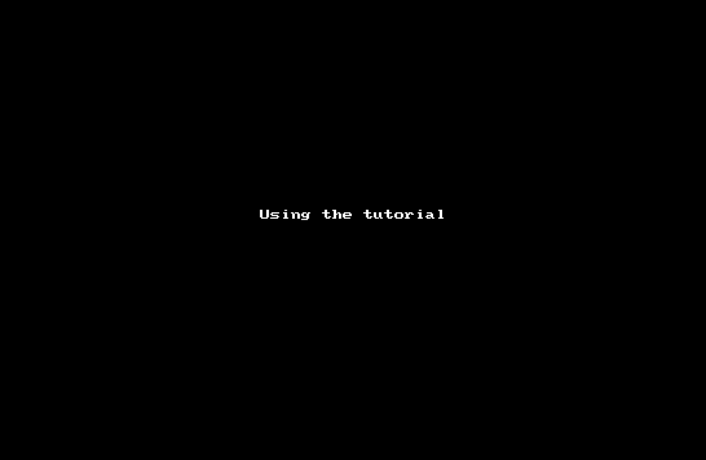

Alfred-codezm-workflows-ssh
===========================



下载
----
[点击下载](https://github.com/codezm/codezm.workflows.ssh/releases/download/v1.0.0/Alfred-codezm-workflows-ssh.alfredworkflow)

配置
----
本插件仅对 ~/.ssh/config 文件进行解析处理。

请确保格式按照以下配置方式进行编写:
```
# This is virtual machine configuration.
Host docker-vm
    HostName 192.168.99.100 
    User docker
    #Password 1234
    #DB dbusername:dbpassword
```

若设置 #Password 选项，则键入 `Enter` 后其值将放入黏贴板并打开默认`Terminal`进行连接。

使用
----
Keyword is `ssh`:
- `ssh [<query>]` — 对`~/.ssh/config`进行查询并过滤展示.
  - `Enter` —将使用默认`Terminal`打开, `Command + v`黏贴密码.
  - `Ctrl + Enter` — 复制数据库用户名.
  - `Command + Enter` — 复制数据库密码.
  - `Shift + Enter` — 复制服务器地址.

如何将 `iTerm` 设为默认 Terminal.
-----------------------------

可参见 [custom-iterm-applescripts-for-alfred](https://github.com/stuartcryan/custom-iterm-applescripts-for-alfred)
